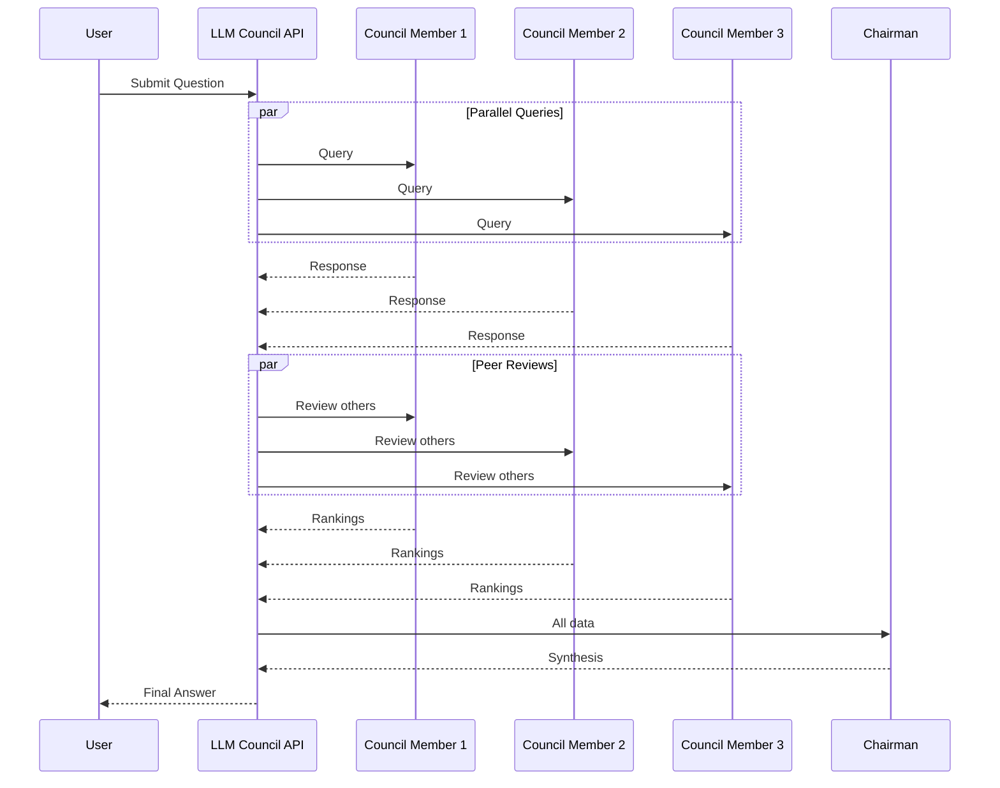
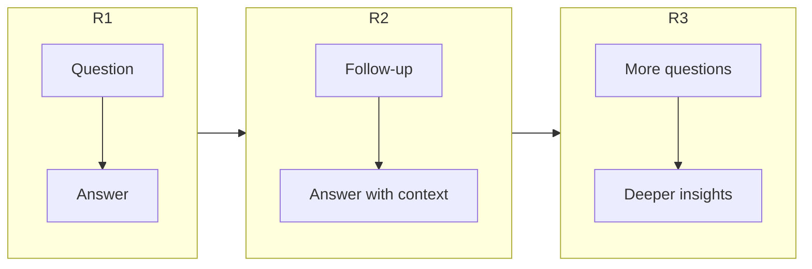

# Council Process

A detailed look at each phase of the council deliberation.

## Process Overview

The council process consists of three distinct phases, each building on the previous one.



## Phase 1: Response Collection

### What Happens

1. Your question is sent to all council members simultaneously
2. Each model generates its response independently
3. Responses are collected and stored

### The Prompt

Each council member receives a prompt like:

```
You are a member of an AI council. Please provide your best answer to the following question.

Question: {user_question}

Previous context (if any): {previous_rounds}

Provide a thorough, well-reasoned response.
```

### Response Format

```json
{
  "model_id": "openai/gpt-4o",
  "model_name": "GPT-4o",
  "response": "The model's complete response...",
  "error": null
}
```

### Handling Failures

If a model fails to respond:

- The error is recorded
- Other models continue normally
- Peer review and synthesis proceed with available responses

## Phase 2: Peer Review

### What Happens

1. Each model receives all other models' responses
2. They evaluate and rank each response
3. They provide reasoning for their rankings

### The Review Prompt

```
You are reviewing responses from other AI models.

Original Question: {question}

Responses to review:
1. Model A: {response_a}
2. Model B: {response_b}

Please rank these responses and explain your reasoning.
Consider: accuracy, completeness, clarity, and helpfulness.
```

### Review Format

```json
{
  "reviewer_model": "anthropic/claude-3.5-sonnet",
  "rankings": [
    {
      "model_id": "openai/gpt-4o",
      "rank": 1,
      "score": 8.5,
      "reasoning": "Comprehensive and well-structured..."
    },
    {
      "model_id": "google/gemini-pro-1.5",
      "rank": 2,
      "score": 7.0,
      "reasoning": "Good but lacks specific examples..."
    }
  ]
}
```

### Why Peer Review Matters

!!! info "Quality Signal"
    Peer reviews provide a **quality signal** that helps the chairman identify the strongest responses and most valuable insights.

- **Consensus Detection**: If all reviewers agree, high confidence
- **Disagreement Analysis**: Different opinions reveal nuance
- **Error Catching**: Models often catch each other's mistakes

## Phase 3: Synthesis

### What Happens

1. The chairman receives all responses and reviews
2. It analyzes the collective input
3. It produces a unified, comprehensive answer

### The Synthesis Prompt

```
You are the chairman of an AI council. Your task is to synthesize
a final answer based on the council's deliberation.

Original Question: {question}

Council Responses:
{all_responses}

Peer Reviews:
{all_reviews}

Based on all perspectives and the peer review feedback, provide
a comprehensive final answer that:
1. Incorporates the strongest points from each response
2. Addresses any disagreements or inconsistencies
3. Presents a clear, unified answer
```

### What Makes Good Synthesis

The chairman should:

- **Identify Common Ground**: Points all models agree on
- **Resolve Conflicts**: Address disagreements thoughtfully
- **Add Value**: Not just summarize, but integrate insights
- **Maintain Coherence**: Produce a readable, unified response

## Status Tracking

Each round progresses through statuses:

| Status | Description |
|--------|-------------|
| `pending` | Round created, waiting for responses |
| `responses_complete` | All council responses collected |
| `reviews_complete` | Peer reviews finished |
| `synthesized` | Final answer produced |

## Continuing Conversations

After synthesis, you can continue with a follow-up question:



The council maintains context from previous rounds, allowing for deeper exploration of topics.

## Next Steps

- [Models](models.md) - Learn about model selection
- [API Reference](../api/sessions.md) - Explore the session endpoints
