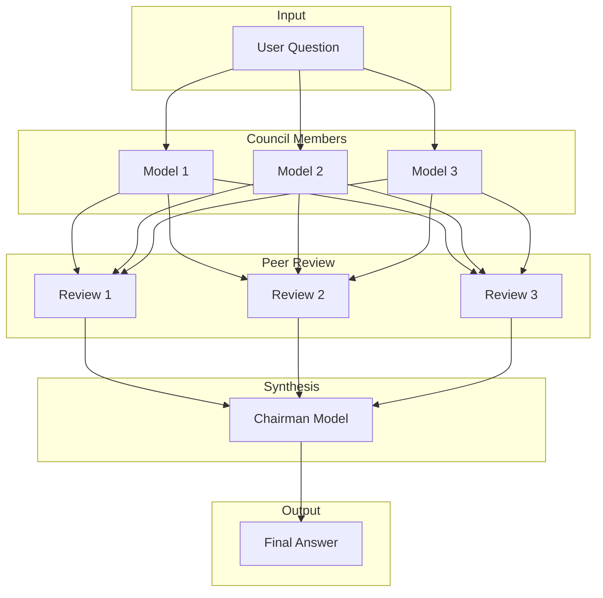
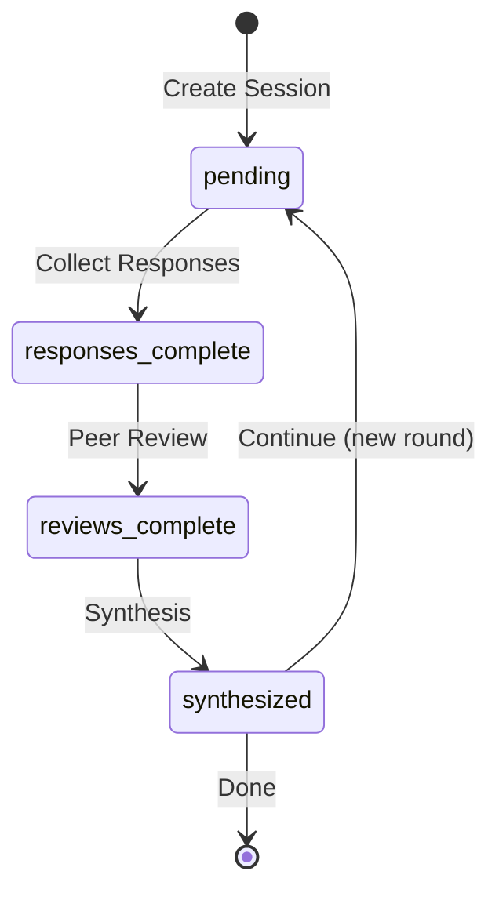

# How It Works

Understand the architecture and flow of LLM Council.

## Overview

LLM Council is built on the principle that **collective intelligence** from multiple AI models produces better results than any single model alone.



## The Three Phases

### Phase 1: Collect Responses

Each council member LLM receives the same question and generates an independent response.

**Why parallel queries?**

- Models don't influence each other
- Each provides their unique perspective
- Different models have different strengths

```
Question: "What are best practices for error handling?"

GPT-4o: "Focus on specific exception types..."
Claude: "Error handling should be defensive..."
Gemini: "Consider the error hierarchy..."
```

### Phase 2: Peer Review

Each model reviews and ranks the other models' responses.

**What happens during peer review:**

1. Each model sees all other responses
2. They evaluate based on accuracy, completeness, and clarity
3. They provide rankings and reasoning

```
Claude reviewing others:
1. GPT-4o (8/10) - "Comprehensive but could be more structured"
2. Gemini (7/10) - "Good examples but missing edge cases"
```

**Benefits:**

- Identifies the strongest responses
- Catches errors or inconsistencies
- Provides multiple quality assessments

### Phase 3: Synthesis

The chairman model analyzes all responses and reviews to produce the final answer.

**The chairman considers:**

- All individual responses
- Peer review rankings and feedback
- Common themes across responses
- Unique insights from each model

**The result:**

A comprehensive answer that incorporates the best elements from all council members while maintaining coherence.

## Architecture

```
┌─────────────────────────────────────────────────────────────┐
│                        Frontend                             │
│                    (React + Vite)                           │
└─────────────────────────┬───────────────────────────────────┘
                          │ HTTP/REST
                          ▼
┌─────────────────────────────────────────────────────────────┐
│                     Backend API                             │
│                  (FastAPI + Python)                         │
│  ┌─────────────┐  ┌─────────────┐  ┌─────────────┐          │
│  │   Routers   │  │  Services   │  │   Schemas   │          │
│  └─────────────┘  └─────────────┘  └─────────────┘          │
└─────────────────────────┬───────────────────────────────────┘
                          │
            ┌─────────────┴─────────────┐
            ▼                           ▼
┌─────────────────────┐     ┌─────────────────────┐
│      MongoDB        │     │     OpenRouter      │
│   (Session Store)   │     │    (LLM Gateway)    │
└─────────────────────┘     └─────────────────────┘
                                      │
                    ┌─────────────────┼─────────────────┐
                    ▼                 ▼                 ▼
              ┌──────────┐     ┌──────────┐     ┌──────────┐
              │  GPT-4o  │     │  Claude  │     │  Gemini  │
              └──────────┘     └──────────┘     └──────────┘
```

## Key Components

### Sessions

A **session** represents a conversation with the council. Sessions can contain multiple rounds of questions and answers.

```json
{
  "id": "uuid",
  "title": "API Design Best Practices",
  "rounds": [
    {
      "question": "What are API design best practices?",
      "responses": [...],
      "peer_reviews": [...],
      "final_synthesis": "...",
      "status": "synthesized"
    }
  ]
}
```

### Rounds

Each **round** is a single question-answer cycle containing:

- The question
- Individual model responses
- Peer reviews
- The synthesized final answer
- Status tracking

### Status Flow



## Why This Approach?

### Advantages

| Benefit                   | Description                                         |
| ------------------------- | --------------------------------------------------- |
| **Diverse Perspectives**  | Different models have different training and biases |
| **Error Reduction**       | Peer review catches mistakes                        |
| **Quality Assurance**     | Multiple evaluations ensure accuracy                |
| **Comprehensive Answers** | Final synthesis combines best insights              |
| **Transparency**          | You can see each model's response                   |

### Trade-offs

| Consideration  | Impact                                      |
| -------------- | ------------------------------------------- |
| **Cost**       | Multiple API calls per question             |
| **Latency**    | Full process takes longer than single query |
| **Complexity** | More moving parts than simple queries       |

## Next Steps

- [Council Process Details](council-process.md) - Deep dive into each phase
- [Models](models.md) - Learn about model selection
- [API Reference](../api/overview.md) - Explore the endpoints
