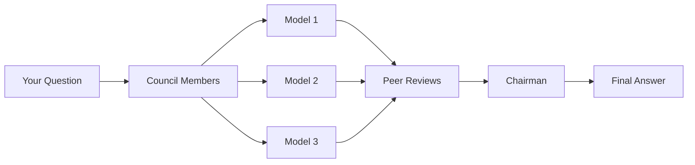

# Welcome to LLM Council

<p style="font-size: 1.2em; color: #888;">
A framework for querying multiple Large Language Models and synthesizing their collective intelligence.
</p>

---

## What is LLM Council?

**LLM Council** is an open-source framework that enables you to query multiple Large Language Models (LLMs) simultaneously and synthesize their responses into a single, well-reasoned answer.

Instead of relying on a single AI model, LLM Council leverages the collective intelligence of multiple models through a structured deliberation process:

- **Multiple Perspectives**: Each council member (LLM) provides their independent answer
- **Peer Review**: Models evaluate and rank each other's responses
- **Synthesis**: A chairman model produces a final answer incorporating the best insights

## Key Features

<div class="grid cards" markdown>

-   :material-lightning-bolt:{ .lg .middle } **Parallel Queries**

    ---

    Query multiple LLMs simultaneously for faster results

-   :material-account-group:{ .lg .middle } **Peer Review System**

    ---

    Models critique and rank each other's responses

-   :material-merge:{ .lg .middle } **Intelligent Synthesis**

    ---

    Chairman model combines the best insights into one answer

-   :material-chat-processing:{ .lg .middle } **Multi-turn Conversations**

    ---

    Continue conversations with context from previous rounds

</div>

## How It Works



1. **Submit a Question** - Send your question to the council
2. **Collect Responses** - Each LLM provides their independent answer
3. **Peer Review** - Models evaluate and rank each other's responses
4. **Synthesis** - The chairman analyzes everything and produces the final answer

## Quick Example

```python
import requests

# Create a new session
response = requests.post("http://localhost:8000/session", json={
    "question": "What are the best practices for API design?"
})
session_id = response.json()["session"]["id"]

# Run the full council process
result = requests.post(f"http://localhost:8000/session/{session_id}/run-all")
final_answer = result.json()["session"]["rounds"][0]["final_synthesis"]

print(final_answer)
```

## Getting Started

Ready to get started? Check out the [Installation Guide](getting-started/installation.md) to set up LLM Council, or jump straight to the [Quickstart](getting-started/quickstart.md) if you prefer learning by doing.

<div class="grid cards" markdown>

-   :material-download: **[Installation](getting-started/installation.md)**

    ---

    Set up LLM Council on your machine

-   :material-rocket-launch: **[Quickstart](getting-started/quickstart.md)**

    ---

    Get up and running in 5 minutes

-   :material-book-open-variant: **[Concepts](concepts/how-it-works.md)**

    ---

    Understand how the council works

-   :material-api: **[API Reference](api/overview.md)**

    ---

    Explore the full API documentation

</div>

## Community

- **GitHub**: [Report issues](https://github.com/samueldervishii/llm-council/issues) or contribute
- **Discussions**: Ask questions and share ideas

---

<p style="text-align: center; color: #666;">
LLM Council v{{ version }}
</p>
